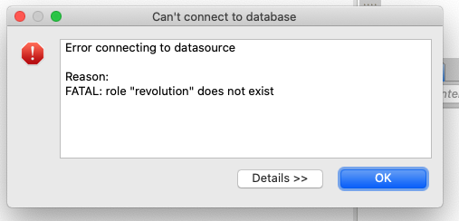

Recently I was working with a Docker image of a Postgres database. Everything was going great.

At one point, I wanted to investigate [different data types of Postgres](../../2019-11-28/postgres-return-type-node-parse).

Instead of trying to figure out how to do that within DBeaver (which was how I was interacting with the Docker), I thought [I would just start up my `psql` shell](../../2019-11-24/postgres-basics-cli) and get the answer that way.

That worked, but later when I tried to query my database, I started getting fatal errors. My role didn’t exist.

A quick search on StackOverflow suggested that this [error can occur when there’s a conflict between Postgres instances](https://stackoverflow.com/a/48594038).

The suggestion was to run `brew services stop PostgreSQL` - which would make sense _if_ you used homebrew to start Postgres in the beginning. I didn’t. I used `pg_ctl -D /usr/local/var/postgres start` - so now, I needed to reverse that with `pg_ctl -D /usr/local/var/postgres stop`.

Once the second instance of Postgres was killed, everything went back to normal.

Hip, hip, hooray!
