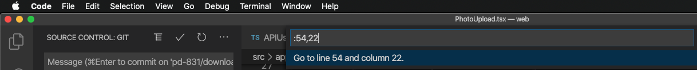

When programming, many tools will specify the line _and_ column numbers.

Normally, because of Intellisense in editors, the line number is sufficient.

But what about when your editor doesn't provide the hint? How do you actually find the specific place?

Take for example, this linting print out:

```shell
$ npm run lint

> @revolution/web@0.3.0 lint /Users/stephen/_coding/remine/revolution/web
> npm run lint:prettylint && npm run lint:tslint


> @revolution/web@0.3.0 lint:prettylint /Users/stephen/_coding/remine/revolution/web
> prettylint 'src/**/*.{ts,tsx}'


  src/apps/AddEdit/CreateListing/Media/PhotoUpload/PhotoUpload.tsx:27:71
  ⚠  27:71  Replace '') with "");  prettier/prettier

  1 warning
```

The issue occurs at line `27`, column `71`. But how do I actually find the column? Unlike line numbers, it's a little harder to spot!

Since I use VSCode, let's look at the solutions VSCode offers.

1. Column Tracking In Footer

It turns out that VSCode tracks (and displays) the current position of the cursor in the bottom bar of the window. This is convenient for knowing where you are. But doesn't help get you somewhere else _fast_.


For that we need a different solution.

2. Jump To The Column With Go To

In VSCode, you can "Go To a Line" with `Ctrl ⌃ + G`, so it's easy to find line 27. (You can also get there with `Cmd ⌘ + P` and then instead of typing a file name, just type a `:`.)

VSCode provides a useful prompt to help here:


As many times as I've used this, I apparently never read the useful prompt which tells you exactly what you need to do! Add a comma after the line number to specify the column.



Et voilá! So many new ways to easily find my place!
