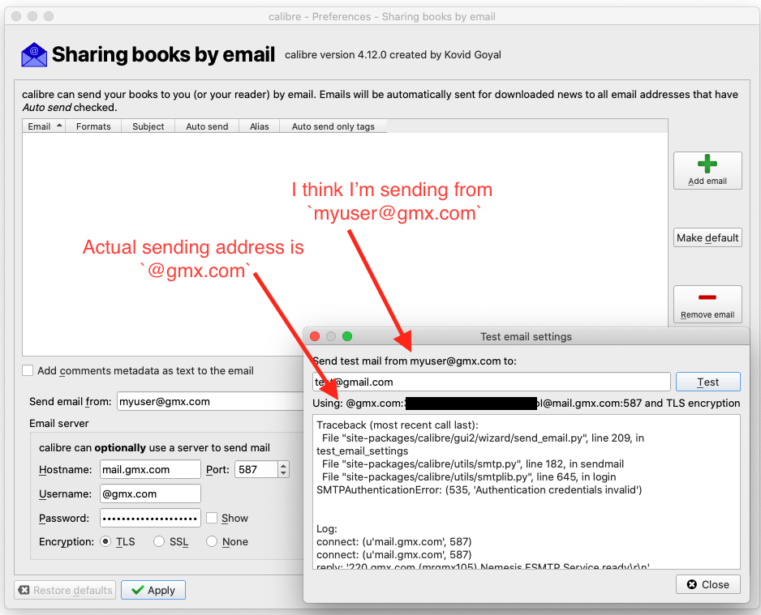
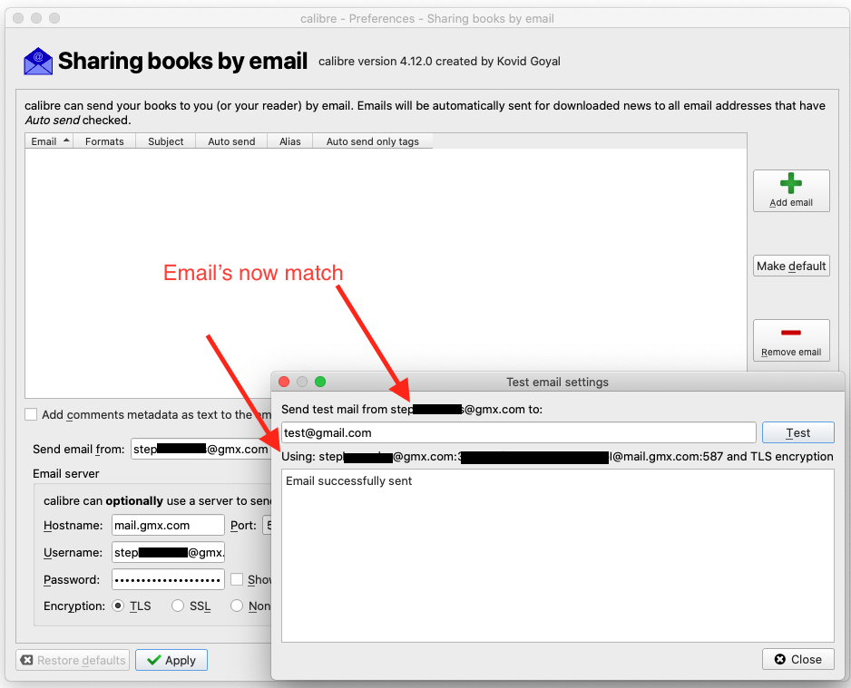

[Calibre](https://calibre-ebook.com/) is an amazing application for managing a library of digital books. I have installed it on every computer I’ve used for years. At some point in that process, I want to take advantage of a feature that allows emailing documents to your devices directly from Calibre.

There’s something about the UI that I find confusing, however, because without fail, I always mess it up the first time. Thank goodness for the internet because I make my way to [this forum conversation](https://www.mobileread.com/forums/showthread.php?t=259331).

```
Traceback (most recent call last):
File "site-packages/calibre/gui2/wizard/send_email.py", line 172, in test_email_settings
File "site-packages/calibre/utils/smtp.py", line 135, in sendmail
File "site-packages/calibre/utils/smtplib.py", line 617, in login
SMTPAuthenticationError: (535, 'Authentication credentials invalid')
```

Kovid Goyal, the creator of Calibre, jumps in with the answer: use the _full_ GMX email address as the username.

Trying to diagnose _why_ I always hit this error, it seems that I interpret the prefilled `@gmx.com` to be an automatically configured setting - similar to the Port. That’s certainly not the case if I think about what the data the field actually needs (that is - a _username_, which in this case includes the domain, and not _just_ the domain<sup>[1](#footnotes)</sup><a id="fn1"></a>). However from a UI perspective, it’s how it feels.



So what does a properly configured email server look like for Calibre?



And just like that, I can now send books by email!
